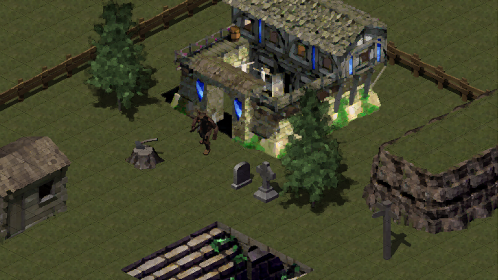

Misioneros Studio is an on-going project working team due to "Project II" subject in CITM University: Videogames Design & Developments degree. Our current aim is to create a RTS videogame called **Mythology Parade** using SDL2 for our subject project.

Misioneros Studio is formed by 8 members:

* **Bernat** Casañas Masip. Github User: @BernatCasanas. Responsibility: **Team Leader**
* **Jordi** Pardo Gutierrez. Github User: @Jordi-Pardo. Responsibility: **Management**
* **Eudald** Garrofé Flix. Github User: @Hevne. Responsibility: **Game Designer**
* **Miquel** Suau Gonzàlez. Github User: @MayKoder. Responsibility: **Code**
* **Josep** Sànchez Arbona. Github User: @daskza19. Responsibility: **Art**
* **Arnau** Falgueras García de Atocha. Github User: @Arnau77. Responsibility: **UI**
* **Marc** Ramos Gomez. Github User: @Ramsubito. Responsibility: **Audio**
* **Roger** Pérez i Romera. Github User: @Rugiacreed. Responsibility: **QA**

***

Mythology Parade is an RTS videogame done by Misioneros Studio that is about trying to impose your religion on the other ones. You will have to manage correctly your resource, units and also the path that your religion is choosing (peaceful or chaotic with it's pros and cons). As a player, you will need to put into test your strategy skills.  

***

<iframe width="560" height="315" src="https://www.youtube.com/embed/pljsC0pNg7A" frameborder="0" allow="accelerometer; autoplay; encrypted-media; gyroscope; picture-in-picture" allowfullscreen></iframe>
